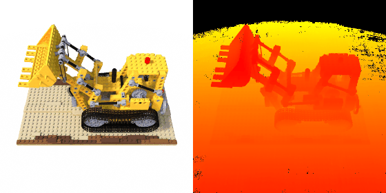
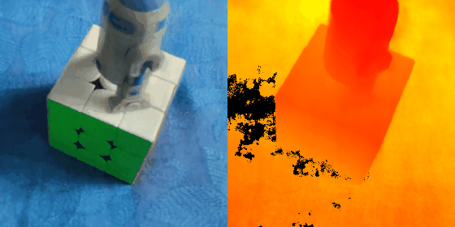

# NeRF TF2

An unofficial implementation of NeRF in TensorFlow 2 for 360-degree inward-facing scenes *(forward-facing scenes are currently not supported -- will add support sometime late Dec 2021 or early Jan 2022).*

    

<i>Fig. 1: Rendered images (on the left) and custom colored depth maps (on the right) for the lego dataset. Note: In general, the depth information can be misleading or incorrect in some cases. Please refer to depth_discussion.md in the docs folder for more information.</i>

    

<i>Fig. 2: Rendered images (on the left) and custom colored depth maps (on the right) for a custom dataset. Note: In general, the depth information can be misleading or incorrect. Please refer to depth_discussion.md in the docs folder for more information.</i>

## 1. Highlights
- Contains an implementation of NeRF for 360-degree inward-facing scenes with both the coarse and fine models.
- The NeRF model class in this codebase is implemented via subclassing the `Model` class from `tf.keras.models`. The object of the NeRF class in this codebase supports the `fit`, `evaluate` and `predict` methods.
- This codebase uses `tf.data.Dataset` based data pipelines to interact with the NeRF model.
- Works with TensorFlow 2.6. Compatiblity with a few older versions will be tested and updated soon.

## 2. Important Notes

### 2.1 General Important Notes
- Currently this codebase does not guarantee determinism. Please be aware of this limitation while conducting your experiments.
- The raw depth estimated by the NeRF algorithm **should not** be used as is. The raw depth is **misleading** in some cases. Moreover, this codebase defines two "types" of depth estimates. For more information about the issues with depth, please refer to the document [depth_discussion.md](docs/depth_discussion.md).
- Experimentation with this codebase was mostly conducted in Google Colab and on a laptop with Ubuntu 18.04. Compatiblity with other working environments and operating systems was not tested.
- The `requirements.txt` in this repository does not exactly repesent the environment in which experiments were run. 
	- This is because a lot of the experiments were run directly on a notebook in Google Colab (where I used the default python environment available in the notebook). Some experiments were run on my laptop but unfortunately I changed environments quite a few times and I did not keep track of them well.
	- However, this `requirements.txt` can still be used to install all the required dependencies and to experiment with this codebase.

### 2.2. Major Differences
- The camera coordinate system format used in this implementation and the official implementation is the camera coordinate system format.
	- This codebase mostly uses the Classic CV coordinate system format, whereas the official implementation mostly uses the OpenGL coordinate system format. For information about the various coordinate system formats mentioned in this codebase, please refer to [coordinate_systems.md](docs/coordinate_systems.md).
	- The above choice was made since I thought that data preparation for custom real life data would be simpler this way. Moreover I believed that the codebase would be a bit easier to understand if the Classic CV format is used.
- Inverse transform sampling has been implemented from scratch in a different way. A different strategy to handle edge cases is employed.
- Several pre-processing and post-processing methods were modified. The interested user is encouraged to explore the codebase to understand the workflow.

### 2.3 Currently Unsupported Features
- Forward-facing scenes are currently not supported. Support is planned to be added sometime late Dec 2021 or early Jan 2022.

## 3. Performance Analysis
- On the lego test set, using the script `evaluate.py` an **Mean PSNR** of **33.0369** was obtained. Using a single V100 GPU on Google Colab, the evaluation took approximately **26.75 seconds per image** (as per the tqdm logs -- also this time includes the time it takes to save each image to disk).
- **However**, the user must be cautious while interpreting this result for many reasons:
	- There are multiple ways of calculating the Mean PSNR metric (for example, calculating the mean PSNR per image and then averaging across images, versus calculating the mean PSNR per batch of pixels and then averaging across all batches etc.).
	- During the training process, the validation PSNR obtained for the saved weights used for this analysis was around 27.67. However, this also should be taken with caution, since only 3 images were used for validation and also because the way PSNR is calculated in `evaluate.py` may be different from the way PSNR was calculated during validation.
	- Also, some configurations were different when compared to the original implementation (for example, here a batch size of 4096 was used).
- In any case, the above information is provided to the user so that they can make a more careful interpretation of the results.
- Further analysis is available in [performance_analysis.md](docs/performance_analysis.md).
- The user can attempt to replicate the evaluation run for the lego test set by following the instructions in section 1.1 of [performance_analysis.md](docs/performance_analysis.md).

## 4. Setup and Data Preparation
This section instructions on how to setup the codebase for usage, and also on how to prepare the data for usage with this codebase.

### 4.1. Setup
Follow the below instructions to setup the codebase for usage:
1. Launch a terminal. 
2. Create a virtual environment using your preferred method. Activate the virtual environment.
3. Git clone this repository and change your directory to the location of this repository in your local filesystem.
	- For example, if you git cloned this repository to `/path/to/nerf-tf2`, please run the command `cd /path/to/nerf-tf2` in your terminal.
4. Install the dependencies using the the following command: `pip install -r requirements.txt`

### 4.2. Data Preparation
This codebase currently supports two types of datasets:
1. The synthetic blender datasets which are mentioned in the official implementation.
2. Custom datasets which represent an "360 degree inward-facing" scene.

For instructions on preparing your dataset, please refer to the document [data_preparation.md](docs/data_preparation.md).

## 5. Usage
The codebase offers 4 scripts which can be run to access various components of this codebase. A brief description of the scripts are given below:
1. `train.py`: Used for launching a training session.
2. `eval.py`: Used for evaluating a model that has already been trained.
3. `render.py`: Used for rendering images using a model that has already been trained.
4. `viz_scene.py`: Used for visualizing the ground truth poses and the inference poses (inference poses are the poses used for rendering in `render.py`).

This section contains instructions on how to use various components of this codebase. 

### 5.1. Common Steps
1. Ensure that the dependencies have been installed (section 4.1) and the data has been prepared (section 4.2)
2. Launch a terminal and activate the virtual environment where you had previously installed the dependencies.
3. Change your directory to the location of this repository in your local filesystem.
	- For example, if you git cloned this repository to `/path/to/nerf-tf2`, please run the command `cd /path/to/nerf-tf2` in your terminal.

### 5.2. Training
Follow the below instructions to launch a training run:

1. Follow the procedure mentioned in the common steps section (section 5.1).
2. Modify the parameters in the configuration file `nerf/params/config.yaml` as per your requirements.
3. Run the training script by running the command `python -m nerf.main.train`

### 5.3. Evaluation
Follow the below instructions to launch an evaluation run:

> Note: To use this script, the user must have the saved metadata and model weights from a previous training run.

1. Follow the procedure mentioned in the common steps section (section 5.1).
2. Modify the parameters in the configuration file `nerf/params/config.yaml` as per your requirements.
3. Run the evaluation script by running the command `python -m nerf.main.eval`

### 5.4. Rendering
Follow the below instructions to launch a rendering run:

> Note: To use this script, the user must have the saved metadata and model weights from a previous training run.

1. Follow the procedure mentioned in the common steps section (section 5.1).
2. Modify the parameters in the configuration file `nerf/params/config.yaml` as per your requirements.
3. Run the rendering script by running the command `python -m nerf.main.render`

### 5.5. Visualization
Follow the below instructions to visualize the ground truth poses and the inference poses in the scene:

> Note: To use this script, the user must have the saved metadata. The saved metadata can be from a previous training run, or can be created using an alternative method. The alternative method will be elaborated in the future.

1. Follow the procedure mentioned in the common steps section (section 5.1).
2. Modify the parameters in the configuration file `nerf/params/config.yaml` as per your requirements.
3. Run the scene visualization script by running the command `python -m nerf.main.viz_scene`

## 6. References
I primarily used the official implementation ([bmild/nerf](https://github.com/bmild/nerf)) as a reference. Occasionally, I also referred to some other implementations ([yenchenlin/nerf-pytorch](https://github.com/yenchenlin/nerf-pytorch), [kwea123/nerf_pl](https://github.com/kwea123/nerf_pl), [google-research/jaxnerf](https://github.com/google-research/google-research/tree/master/jaxnerf), [krrish94/nerf-pytorch](https://github.com/krrish94/nerf-pytorch)) to get insights about certain details.

I also referred to the COLMAP repository ([colmap/colmap](https://github.com/colmap/colmap)) and their [docs](https://colmap.github.io/) for the camera models and other information that was useful for various parts of this codebase.

## 7. License and Citation
This repository is licensed under the MIT license. If you use this repository (or parts of it) in your work, please consider citing this repository.
