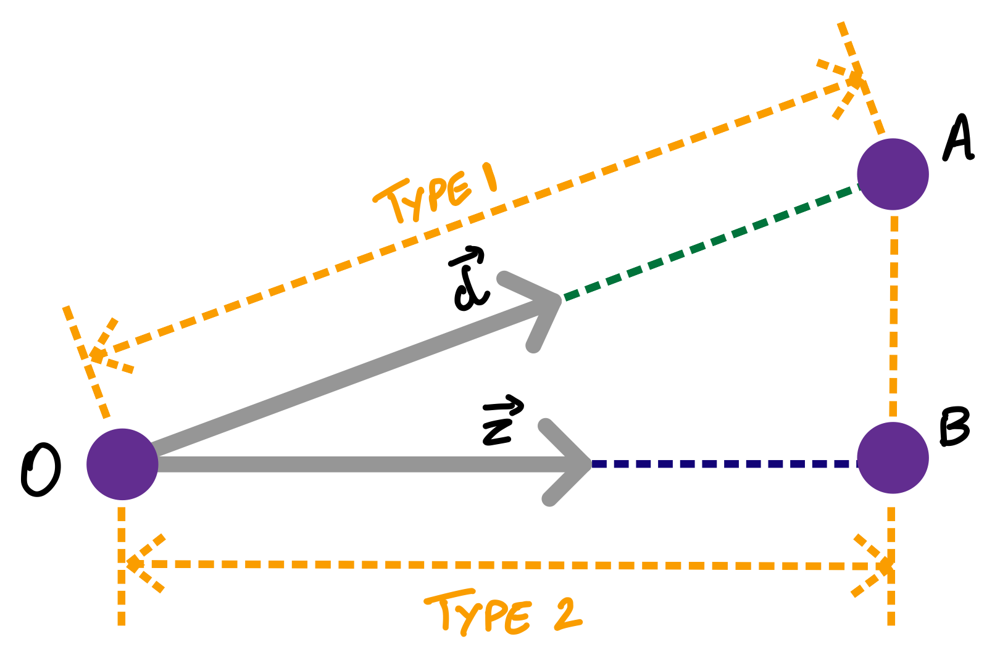

# Depth Discussion

In this document, we discuss two points about the depth estimated about the NeRF model:
1. The raw depth estimated by the NeRF algorithm **should not** be used as is. The raw depth is **misleading** in some cases. The reasoning behind it is explained.
2. There are **two types** of depth estimates that are defined in this codebase. The user should choose the type that they prefer.

In the following section, these points are discussed in greater detail.

## Issue 1

The raw depth estimated by the NeRF algorithm **should not** be used as is. The raw depth is **misleading** in some cases.

To understand why, please observe this codeblock which is taken from the function `post_process_model_output` in `nerf/utils/ray_utils.py`:

```python
# Shape of pred_depth: (N_rays,)
pred_depth = tf.reduce_sum(t_vals * weights, axis = 1)

# Shape of acc_map: (N_rays,)
acc_map = tf.reduce_sum(weights, axis = 1)
```

In the official codebase, this depth estimate is called the "expected distance" (please check this [comment](https://github.com/bmild/nerf/blob/20a91e764a28816ee2234fcadb73bd59a613a44c/run_nerf.py#L149) in the official codebase). 

The issue is the usage of `weights`. In some cases, some rays may never hit any object in the scene **within** the far bound. Hence, those rays may have a weight of 0 for all its `t_vals`. In that case, `pred_depth` for that ray would be calculated as 0. This is incorrect because in this case those rays have already travelled beyond the far bound so it should have a large depth value!

The question now is, how do we discard the incorrect depth values ?

One strategy that could be proposed is to make use of the `acc_map` parameter. In the official codebase, the `acc_map` is referred to as the "accumulated opacity along each ray" (please check the explanation [here](https://github.com/bmild/nerf/blob/20a91e764a28816ee2234fcadb73bd59a613a44c/run_nerf.py#L84)). In the official codebase, it is also mentioned that `acc_map` is a value in the range `[0, 1]` upto some numerical error (please refer to the comment [here](https://github.com/bmild/nerf/blob/20a91e764a28816ee2234fcadb73bd59a613a44c/run_nerf.py#L156)). The strategy is to only use the depth values of those rays whose `acc_map` value is very close to 1 and discard the the other depth values. 

The depth maps of the GIFs in `README.md` were created using the above strategy. The black regions in the GIFs are the regions where the depth was deemed to be "unreliable" (i.e. those regions had rays whose `acc_map` value was not close to 1). The other regions were colored using the autumn colormap which is available in matplotlib.

However, this strategy may not be always accurate as well. This is because we are relying on "accmulated opacity". What if the scene has transparent and translucent objects ? Will the depth values of the rays whose valus in `acc_map` are close to 1 be accurate in this case ? Also, what if the output of the network has artefacts? What would be the depth values of those artefacts?

The above are questions for which I do not have a proper answer or a solution for. I would be glad to have a discussion with anyone who has more insight on these topics.

In any case, the user should be very careful while using the raw depth values due to these issues. The depth outputs are created by `render.py` for experimentation purposes.

## Issue 2

Two types of depth are estimated by this codebase. They are:
1. Type 1: This type of depth represents the distance travelled by the ray.
2. Type 2: This type of depth represents the scalar projection of the ray onto the camera's z-direction.

The below diagram roughly shows the differences between the two types of depths. The user should choose the representation that they desire.



The depth maps of the GIFs in `README.md` used the Type 2 depth representation.
